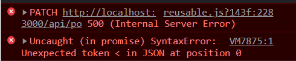

#### Title

#### Problem Summary

1. Editing the PO.status === 'Closed' would trigger another create request (FE & BE) for a transaction.
2. As soon as this condition was met, some failures were observed.

   1. **`Error: overwrite of po is undefined`**: This gave the impression that
      1. data returned after `find` method of `mongoDB` was `null` or wrong.
      2. Or the payload wasn't correct
      3. Or overwrite is not the correct way to edit the PO.
   2. **`Error: transaction ..E110... something about duplicate refId`**: The error looked as if it was caused by DB and that the unique IDs were found to be already existing. This was weird bcz `refId` was not a property of transaction and the error was returned from the transaction API path. How did `refId` even get there ?

3. Another weird thing observed with the first error was that even though the error said something about `po` but the network request showed the **transaction-api-path**.
4. Sometimes, a PO was observed to be created with null values. It looked as if the data from transaction request was being sent to the some controller function of po. And due to the strict schema definition of `PO` the transaction data would not be allowed to fill in and instead a new entry without any values was created showing a blank entry in UI **on reload**.
5. Finally, after trying to use a separate `next-connect` for every api path the issue was not observed anymore. Which meant that the `next-connect` messed up the data between the **different paths** when two apis were called in one server-trip.
6. **No such problem was observed earlier because none of the other requests involved two api paths.**
7. It was also observed midway, that `GET` request controller was somehow necessary to make the `PATCH` requests work.

#### Problem Diagnosis

- **Stage 01**
  - Changing the POs after the status of any PO has been set to "Closed" is not possible.
  - Looks like it happens once a transaction has been made
- **Stage 02**
  - Commenting the section which triggers the transaction-creation in `poApollo.js` works.
  - This implies that error is related to txn-creation. Maybe something in the txn-handler, database or state related logic, is wrong.
- **Stage 03**
  - Commenting the add-txn-to-db code and running the add-txn-to-state works.
  - The transaction-data added to txn-state is coming directly from po-manipulation-functions. (mapPOtoTXN)
- **Stage 03**
  - Uncommented the add-txn-to-db code.
  - The state data is still being fed from forms directly (NOT from returned data of db update)
  - However, still the error is produced.
  - It seems that just the fact that http request is made to transactionDB will create the error.
- **Stage 04**
  - Changed the method of http request to "GET" to check if it is just about talking to DB or about the return values from database.
  - Working (even though it threw an error once)
  -
- **Stage 05**
  - Replace the request method back to "POST" but changed the body to trigger a single transaction post (earlier it was posting multiple transactions)
  - It is noted that the error is shown when PO is edited (Edit doesn't necessarily have to be in PO.status)**After** status is changed **TO "Closed"** (Not FROM "Closed") .
  - Still Not Working
    

##### Changes Progress

#### Code Comparison

##### Before

Earlier, an ncHandler was defined in a separate `config.js` file. and then Imported into the `api` page file.

**config.js**

```
import nc from 'next-connect'; // import
const ncHandler = nc() // called
export ncHandler; // exported to be used wherever requests are handled
```

**API-page.js**

```
import { ncHandler } from '... config-path.js'

ncHandler.get(... getController ...);
ncHandler.delete(... deleteController ...);
ncHandler.create(... createController ...);
ncHandler.patch(... updateController ...)


export default ncHandler;
```

##### After

Now, the `next-connext` is imported, called and exported right into the `api-page` (where the requests are handled) directly.

**API-page.js**

```
import nc from 'next-connect'; // directly imported

const ncHandlerOwn = nc()

ncHandlerOwn.get(... getController ...);
ncHandlerOwn.delete(... deleteController ...);
ncHandlerOwn.create(... createController ...);
ncHandlerOwn.patch(... updateController ...)


export default ncHandlerOwn;
```

#### Solution(s)

Don't use 01 `nextConnect` for every **api-path**.

### Resources

1. This [Youtube Video](https://www.youtube.com/watch?v=01RTj1MWec0) tells more about Solution #02.
2. After solving the issue, I wrote to a friend who tried to help debug the issue.

> done ho gya bhai.... error resolved. was using next-connect for handling API request.
> The problem was that i created a single next-connect-functin in a config.js file and imported in every api-page.
> This was OK for all the other APIs when the requests for one-server trip were generated from a single api-path.
> In this case, i triggered a transaction request and po request in one-server-trip... This meant that the next-connect-function generated in this trip would have to handle the requests coming from 02 different API paths (PO & TXN path). This caused the next-connect-function to mishandle the data between the requests and the data from one-request would end up in the other request.
> As a solution, i just changed my API-pages to import and use the next-connect directly in the file and deleted the one i created in config.js . Now they're working properly.
